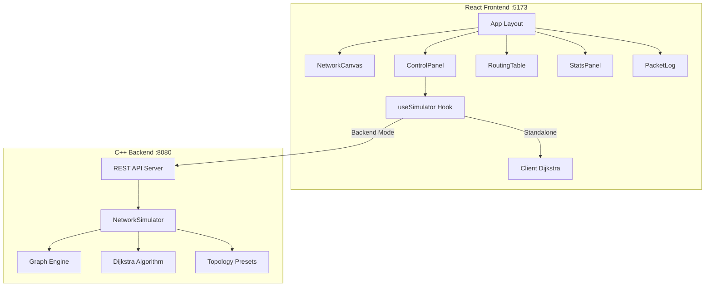

<div align="center">

# 🌐 AlgoNet

### **Network Routing Simulator**

*A C++ network routing simulator that models routers as weighted graphs and computes optimal packet paths using Dijkstra's algorithm, featuring an interactive React + Tailwind CSS visualization dashboard.*

[](https://isocpp.org/)
[](https://react.dev/)
[](https://tailwindcss.com/)
[](./LICENSE)

---

**[Features](#features) · [Architecture](#architecture) · [Quick Start](#quick-start) · [Tech Stack](#tech-stack) · [API Reference](#api-reference)**

</div>

---

## 📋 Overview

**AlgoNet** is a full-stack network routing simulator built from the ground up. The core engine, written in C++17, implements Dijkstra's shortest path algorithm on dynamically constructed network topologies. A modern React frontend provides real-time, interactive graph visualization with animated packet routing.

> **Key Differentiator:** The frontend ships with a built-in JavaScript Dijkstra implementation, so the entire simulator works as a **standalone web app** without the C++ backend — perfect for demos and quick exploration. When the backend is running, it seamlessly delegates computation to the C++ engine for production-grade performance.

---

## ✨ Features

### Core Algorithm
- **Dijkstra's Shortest Path** — Priority-queue-based implementation with O((V + E) log V) complexity
- **Distance Table Computation** — Full single-source shortest distances for routing analysis
- **Path Reconstruction** — Optimal route recovered via predecessor tracking
- **Dynamic Router Status** — Routers can be toggled active/inactive, with real-time path recalculation

### Network Simulation
- **Weighted Graph Model** — Routers as nodes, links as weighted edges (latency in ms)
- **Packet Simulation** — Send packets through the network, tracking hops, latency, and delivery status
- **Preset Topologies** — Mesh, Ring, Star, Tree, and Random network configurations
- **Simulation Statistics** — Delivery rate, average latency, hop count, and real-time counters

### Interactive Frontend
- **Canvas-Based Graph Visualization** — Smooth 60fps rendering with glow effects and grid background
- **Drag & Drop Nodes** — Reposition routers by dragging them on the canvas
- **Animated Packet Routing** — Watch packets traverse the shortest path with neon trail effects
- **Glassmorphism UI** — Dark theme with blurred glass panels and cyber-neon accent colors
- **Responsive Design** — Adapts to different screen sizes with collapsible panels

---

## 🏗 Architecture

```
AlgoNet/
├── simulator/                  # C++ Backend
│   ├── CMakeLists.txt          # CMake build configuration
│   ├── include/
│   │   └── httplib.h           # cpp-httplib (vendored, header-only HTTP server)
│   └── src/
│       ├── main.cpp            # Entry point — starts HTTP server on :8080
│       ├── core/
│       │   ├── Router.h        # Router model (id, name, coordinates, status)
│       │   ├── Packet.h        # Packet model (source, dest, path, status)
│       │   ├── Graph.h         # Graph interface (adjacency list)
│       │   └── Graph.cpp       # Graph implementation
│       ├── algorithms/
│       │   ├── Dijkstra.h      # Dijkstra interface
│       │   └── Dijkstra.cpp    # Shortest path + distance table
│       ├── simulator/
│       │   ├── NetworkSimulator.h   # Simulation orchestrator interface
│       │   └── NetworkSimulator.cpp # Topology mgmt, packet routing, presets
│       └── api/
│           └── Server.cpp      # REST API endpoints with CORS
│
├── frontend/                   # React Frontend
│   ├── index.html
│   ├── vite.config.js
│   ├── tailwind.config.js
│   └── src/
│       ├── main.jsx
│       ├── App.jsx             # Main layout with 3-panel design
│       ├── index.css           # Global styles + Tailwind + glass effects
│       ├── hooks/
│       │   └── useSimulator.js # State management + client-side Dijkstra
│       ├── services/
│       │   └── api.js          # Backend API client
│       └── components/
│           ├── NetworkCanvas.jsx  # Interactive graph canvas
│           ├── ControlPanel.jsx   # Sidebar: topology + routing controls
│           ├── RoutingTable.jsx   # Path + distance table display
│           ├── StatsPanel.jsx     # Simulation statistics
│           └── PacketLog.jsx      # Packet history log
│
├── README.md
├── LICENSE
└── .gitignore
```

<details>
<summary><b>System Architecture Diagram</b></summary>



</details>

---

## 🚀 Quick Start

### Frontend Only (No C++ Required)

```bash
cd frontend
npm install
npm run dev
```

Open [http://localhost:5173](http://localhost:5173) — the simulator runs entirely in the browser.

### Full Stack (C++ Backend + React Frontend)

#### 1. Build the C++ Backend

```bash
cd simulator
mkdir -p build && cd build
cmake ..
make
```

#### 2. Run the Backend

```bash
./algonet_server
```

The server starts on `http://localhost:8080`.

#### 3. Run the Frontend

```bash
cd frontend
npm install
npm run dev
```

Open [http://localhost:5173](http://localhost:5173) and toggle **Backend Mode** in Settings.

### Prerequisites

| Component | Requirement |
|-----------|-------------|
| C++ Backend | C++17 compiler (GCC 7+, Clang 5+, MSVC 19.14+), CMake 3.14+ |
| Frontend | Node.js 18+, npm 8+ |

---

## 🛠 Tech Stack

| Layer | Technology | Purpose |
|-------|-----------|---------|
| **Core Algorithm** | C++17 | Dijkstra's algorithm, graph data structures |
| **HTTP Server** | [cpp-httplib](https://github.com/yhirose/cpp-httplib) | Lightweight, header-only REST server |
| **Frontend** | React 19 + Vite | Component-based UI with fast HMR |
| **Styling** | Tailwind CSS 3 | Utility-first CSS with custom dark theme |
| **Visualization** | HTML5 Canvas API | 60fps graph rendering with animations |

---

## 📡 API Reference

All endpoints return JSON. The backend runs on `http://localhost:8080`.

| Method | Endpoint | Description |
|--------|----------|-------------|
| `GET` | `/api/topology` | Get current network topology |
| `POST` | `/api/topology/preset` | Load preset (`mesh`, `ring`, `star`, `tree`, `random`) |
| `POST` | `/api/topology/clear` | Clear all routers and links |
| `POST` | `/api/router` | Add a router `{name, x, y}` |
| `POST` | `/api/router/toggle` | Toggle router active/inactive `{id}` |
| `POST` | `/api/link` | Add a link `{from, to, weight, bandwidth}` |
| `POST` | `/api/route` | Compute shortest path `{source, destination}` |
| `POST` | `/api/simulate` | Send a packet `{source, destination, payload}` |
| `GET` | `/api/stats` | Get simulation statistics |
| `GET` | `/api/packets` | Get packet log |

<details>
<summary><b>Example: Find Shortest Path</b></summary>

```bash
curl -X POST http://localhost:8080/api/route \
  -H "Content-Type: application/json" \
  -d '{"source": 0, "destination": 4}'
```

```json
{
  "reachable": true,
  "totalCost": 7.0,
  "path": [0, 1, 2, 4],
  "distances": {"0": 0, "1": 2, "2": 3, "3": 6, "4": 7, "5": 7},
  "previous": {"0": -1, "1": 0, "2": 1, "3": 2, "4": 2, "5": 3}
}
```

</details>

---

## 🧠 Algorithm Details

### Dijkstra's Algorithm

The core uses a **min-priority queue** (binary heap) implementation:

```
DIJKSTRA(G, source):
    dist[v] ← ∞  for all v ∈ V
    dist[source] ← 0
    Q ← min-priority queue of all vertices

    while Q is not empty:
        u ← extract-min(Q)
        for each neighbor v of u:
            if dist[u] + weight(u,v) < dist[v]:
                dist[v] ← dist[u] + weight(u,v)
                prev[v] ← u
                decrease-key(Q, v)

    return dist[], prev[]
```

**Complexity:** O((V + E) log V) with binary heap

### Key Design Decisions
- **Undirected graph** — Links are bidirectional (models real network switches)
- **Inactive router handling** — Dijkstra skips disabled routers, simulating link failures
- **Header-only HTTP** — cpp-httplib is vendored to eliminate external build dependencies
- **Dual-mode frontend** — Client-side Dijkstra for standalone use, with optional C++ backend delegation

---

## 📄 License

This project is licensed under the MIT License — see the [LICENSE](./LICENSE) file for details.

---

<div align="center">

**Built with ❤️ using C++17, React, and Tailwind CSS**

</div>
